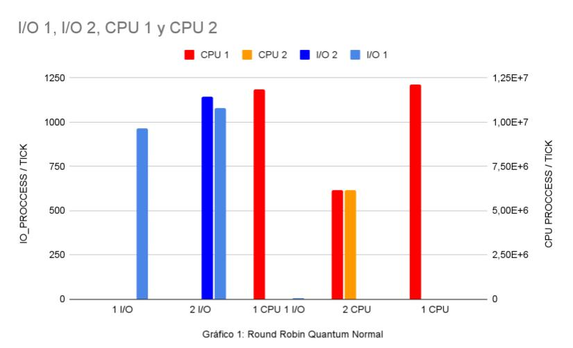
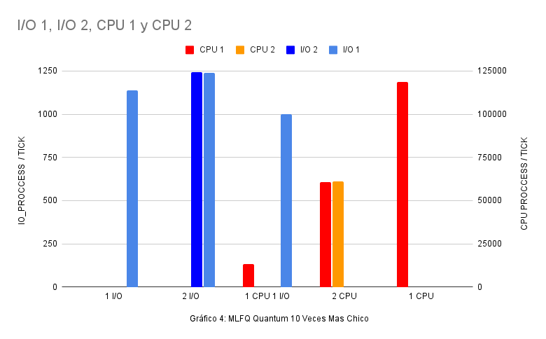
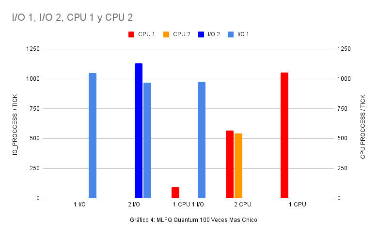

INFORME : Laboratorio 3 Scheduler

Grupo 23

Integrantes :

-   *Bazán Tomás*
    
-   *Carabelos Milagros*
    
-   *Pereyra Carrillo Juan Cruz*
    
-   *Scavuzzo Ignacio*

## Indice

1. [Introducción](#Introducción)
2. [Scheduler de xv6](#Scheduler-de-xv6)
   - [¿Cuánto dura un cambio de contexto en xv6?](#**¿Cuánto-dura-un-cambio-de-contexto-en-xv6?** )
   - [¿El cambio de contexto consume tiempo de un quantum? ¿El cambio de contexto se le cobra al proceso?](#¿El-cambio-de-contexto-consume-tiempo-de-un-quantum?-¿El-cambio-de-contexto-se-le-cobra-al-proceso?)
   - [¿Hay alguna forma de que a un proceso se le asigne menor tiempo?](#¿Hay-alguna-forma-de-que-a-un-proceso-se-le-asigne-menor-tiempo?)
3. [MLFQ](#MLFQ)

   - [Elección de la prioridad](#Elección-de-la-prioridad)

   - [Yield](#Yield)

   - [Sleep](#Sleep)

   - [Dos versiones](#Dos-versiones)
     1. [Versión 1](#Versión 1:)
     
     2. [Versión 2](#Versión 2:)
4. [Mediciones](#Mediciones)

   - [¿Por qué cambiar la implantacion?](#¿Por-qué-cambiar-la-implantacion?)
5. [Análisis de Datos y Conclusiones](#Análisis-de-Datos-y-Conclusiones)
   - [¿Cómo se leen los gráficos?](#¿Cómo-se-leen-los-gráficos?)
   - [Análisis](#Análisis)
6. [Organización](#Organización)


## Introducción
---

Xv6 es un pequeño sistema operativo que vamos a usar para estudiar el foco de este laboratorio: el planificador.
Un planificador (o scheduler) es el encargado de decidir y organizar qué proceso debería correr en cada momento. Más adelante detallaremos sus objetivos y métodos. 
En este trabajo, primero analizaremos el planificador que presenta xv6 para entender su funcionamiento, y a partir de ello, nos proponemos a mejorarlo implementando algunas modificaciones que creemos lo optimizaran. Luego nos preguntamos: ¿En qué medida sirvieron las modificaciones? Para responder esto, analizaremos varios datos proporcionados por dos programas, cpubench y iobench, para medir la incidencia de los cambios. Como hipótesis suponemos que la implementación de un nuevo planificador mejorará el rendimiento y la funcionalidad de este(mencionado en la parte 3: MLFQ).

---
## Scheduler de xv6
En xv6 el planificador se implementa en el archivo proc.c y utiliza la política Round Robin. Para seleccionar el orden de los procesos, hace uso de una cola de procesos completada, inicialmente, por orden de llegada pero que luego se comporta de manera aleatoria de acuerdo a los procesos que se eliminan de la cola. La función **scheduler** implementa un for infinito que sólo sale en caso de error. Revisa si el proceso que se eligió de la lista está listo para correr (RUNNABLE), si es así, setea su campo de estado a corriendo (RUNNING), asigna a un cpu el proceso y ejecuta un cambio de contexto. Al terminar de ejecutar ese programa por el *quantum* correspondiente, restablece el proceso en ejecución de la CPU a 0, es decir a init donde corre el kernel . La política Round Robin requiere del *quantum* ya mencionado, ya que este es el tiempo máximo que corre un proceso hasta que el sistema operativo interrumpa su ejecución y libere la cpu  (por ejemplo: para round robin de quantum = 2 con tres procesos A,B,C, corre AABBCCAABBCC, esto sin tener en cuenta el tiempo de cambio de contexto). Un quantum en XV-6 dura por defecto 100ms. La variable que define ese tiempo está definida en kernel/start.c y se llama **interval**.

#### ¿Cuánto dura un cambio de contexto en xv6?
Esta pregunta es un poco ambigua: para responder deberíamos definir primero lo que llamamos “cambio de contexto”. 
Si con cambio de contexto nos referimos únicamente a guardar la información necesaria para poder volver a correr el programa en ejecución en un futuro y establecer los registros necesarios para ejecutar el nuevo proceso, podemos ver que este paso se logra utilizando función de `void swtch(struct context *, struct context *)` la cual está escrita en assembler y se encarga de guardar el 1er contexto en memoria y cargar el contexto 2 en la CPU para la ejecución deseada. El tiempo de ejecución de este assembler es prácticamente nulo porque es un código bastante simple sin ningún salto que confunda al procesador o no le permita hacer predicciones sobre lo que se va a ejecutar. Es el código más cercano que vamos a encontrar a ejecutar un binario plano y sabemos que la computadora puede hacer esto muy rápido. Sin embargo, si con cambio de contexto nos referimos a pasar de un proceso (llamémosle proceso A) al kernel aquí tendremos que chequear cuánto lleva ejecutar `void sched(void)`. Si incluso queremos ampliar más el rango y llamamos cambio de contexto a pasar de un proceso A a otro proceso B deberíamos tomar en cuenta todo lo anterior más el tiempo que le lleve a la función `void scheduler(void)` establecer el contexto del programa B en la CPU. Pero entonces podemos preguntarnos ¿el tiempo que utilizamos para elegir qué proceso va a correr al final del context switch es parte del tiempo que deberíamos estimar?

#### ¿El cambio de contexto consume tiempo de un quantum? ¿El cambio de contexto se le cobra al proceso? 
Notamos una situación interesante en la estructura de los procesos ubicada en `proc.h`. Ésta no guarda ninguna información sobre el tiempo que estuvo corriendo el proceso en CPU antes de la interrupción (ya sea por finalización del quantum, intentar realizar alguna acción privilegiada, pedir acceso a I/O o simplemente devolverle el control al kernel cooperativamente). Esta situación nos da la idea de que en esta versión de xv6 si un proceso libera el CPU antes de que termine su quantum, el tiempo que tiene para correr el siguiente proceso es lo que queda de este quantum. Podríamos decir que el cambio de contexto no se le cobra al proceso que lo solicitó pero podría tener cierto efecto negativo en el siguiente proceso en el caso que justo el pedazo de quantum que sobró era bastante corto y no llegara a correr mucho tiempo. Concluimos así que si bien el cambio de contexto puede perjudicar el tiempo disponible para un cierto proceso suele no afectar demasiado al proceso que devuelve el quantum antes de su finalización sino al siguiente proceso que se va a correr.

#### ¿Hay alguna forma de que a un proceso se le asigne menor tiempo?
Es posible, como mencionamos anteriormente, esta versión de xv6 no tiene la capacidad de guardar cuánto tiempo estuvo corriendo un proceso. Por lo tanto, si algún proceso libera el CPU antes de que termine el quantum, el siguiente proceso ejecutará en lo que quede de ese quantum sin restablecerlo al valor predeterminado. De esta manera al proceso 2 se le estaría asignando menos tiempo para correr.

---
## MLFQ

Originalmente el scheduler corre los procesos en Round Robin con un quantum de 1/10th segundos. Nuestra tarea era mantener esta forma de planificar sólo en las colas de ejecución, las cuales tendrán nuestros procesos seleccionados de acuerdo a su prioridad, ésta tendría que ser seteada de acuerdo a las necesidades del proceso, si precisa más tiempo de cómputo o se bloquea pidiendo entrada salida o accesos a memoria.

#### Elección de la prioridad
Decidimos modificar la prioridad de nuestro procesos según como se desplanificaban, es decir cuál era el método que usaba el SO para dejar de correr el programa y cambiar a kernel, identificamos dos formas principales, yield y sleep. 
Nuestro rango de prioridades se mueve desde NPRIO-1 hasta 0 siendo NPRIO = 3 y la prioridad numéricamente mayor la que corresponde a los procesos que deberían atenderse antes.

#### Yield
Los procesos que se desplanifican mediante **yield** en la mayoría de los casos es de forma forzosa, es decir el SO decide que ya corrieron por suficiente tiempo (utilizaron todo su quantum) y los retira, en este caso la prioridad de nuestro proceso decrece ya que estaríamos en una situación donde el proceso necesita usar mucho la cpu y no necesita ser tan responsivo.

#### Sleep
Los procesos se planifican mediante **sleep** cuando quedan bloqueados esperando alguna "señal" del sistema por ejemplo un acceso a memoria o un I/O, en este caso el proceso suele necesitar interacción con el usuario es decir ser de rápida respuesta y no utilizan casi tiempo en la cpu (no terminan su quantum), por estas razones decidimos darles más prioridad para que, ya que son más cortos, corran mas veces y su tiempo de respuesta mejore.

#### Dos versiones
Implementamos dos versiones del planificador con pequeñas modificaciones. 

##### Versión 1:

Esta primera versión del Scheduler MLFQ está disponible en la rama scheduler inicial y funciona como una cinta transportadora de procesos. La cual va eligiendo, de manera lineal, aquellos procesos con mayor prioridad y cuyo estado sea “RUNNABLE” . No se utilizan colas de prioridades, todo se implementa sobre la lista de procesos. Una vez elegido este proceso, se ejecuta. 

Problema: Heavy Starvation. Sólo puede ir viendo el elemento i-esimo y los siguientes, pero puede ser que un proceso anterior haya pasado su estado a RUNNABLE y tengo una prioridad mayor. Este proceso recién va a ser ejecutado cuando se reinicie el bucle.

##### Versión 2:

Ésta implementación del Scheduler MLFQ funciona de la misma manera que la anterior pero ahora sumamos una array de enteros donde sus índices son las prioridades: 		

```c
  unsigned int tableproc[NPROC] = {0}
```

Este array guarda cuantos procesos con estado RUNNABLE tienen la i-ésima prioridad. Dado un proceso p, cada vez que se le cambie el estado a RUNNABLE hacemos:

```c
  tableproc[p->priority]++
```

Dentro de nuestro scheduler utilizaremos el mismo bucle o “cinta transportadora” que utilizamos en la versión 1. La única diferencia es que cambiamos nuestra política de selección y búsqueda de procesos. Buscamos en la **tableproc** cual es el mayor índice (var int actual_priority) cuyo valor es mayor (estricto) a 0. Si encontramos el proceso p con p->priority == actual_priority y su estado es RUNNABLE, restamos 1 al valor de tableproc[actual_priority] ya que este proceso ahora tiene estado RUNNING y corremos el proceso seleccionado. 

Problema: Priority_starvation. Los procesos cuya prioridad es menor son más propensos a sufrir de starvation. Ya que nuestro scheduler puede quedarse corriendo los procesos de prioridades más altas infinitamente.

Solución: Utilizamos un contador que al cruzar cierto límite “MAX_P_COUNT” actualiza la prioridad a buscar a la del proceso actual sin importar su estado.

```c
  if (p_count >= MAX_P_COUNT){
			actual_prio = p->priority;
	}
```

---
## Mediciones
Para las mediciones vamos a correr dos programas: cpubench e iobench. Los ejecutaremos aislados y de manera combinada. Así podremos ver su rendimiento en distintos contextos.Tratando siempre que el entorno sea lo más controlado y constante posible.

Podemos deducir de la implementación del scheduler de xv6 que los datos serán más beneficiosos para los procesos CPU Bound, ya que no existe una manera de darle prioridad a los procesos IO Bound. Ésto perjudica el tiempo de respuesta , sobre todo al correr 1 cpubench y 1 iobench, ya que el iobench pasa mucho tiempo esperando a ser ejecutado, y utiliza muy poco tiempo de su quantum debido a que el pedido de I/O lo lleva a bloquearse .

Luego mediremos cómo reacciona el scheduler al achicar el quantum. Para esto iremos eliminando un 0 en el quantum y agregándole a *MINTICKS* , para que las distintas medidas sean comparables y los programas corran por el mismo tiempo. Podemos esperar que, a medida que el quantum sea menor, los procesos IO Bound aumenten su rendimiento por el hecho de que pasarán menos tiempo esperando a ser ejecutados.

#### ¿Por qué cambiar la implantacion?
Queremos modificar la política de planificación de xv6 (Round Robin) a una MLFQ (Multi Level Feedback Queue) con el objetivo de maximizar la utilización del CPU, minimizar el tiempo de retorno, minimizar el tiempo de respuesta, y mejorar la diferenciación entre procesos I/O Bound y CPU Bound. Con MLFQ buscamos un sistema de prioridades y que haga más equitativo el manejo de los procesos.

---
## Análisis de Datos y Conclusiones
Realizamos un análisis de datos de procesos I/O bound y CPU bound para la política de xv6 para luego contrastarlos con una política MLFQ. Cabe destacar que modificamos los programas iobench y cpubench para que en vez de hacer operaciones de punto flotante sean operaciones de Int, ya que al tratar de ejecutarlos ocurría un *panic trap*. 

Primero realizamos mediciones con quantums por defecto. Veremos cómo se comportan los procesos IO bound y CPU bound en distintas combinaciones. Luego veremos qué ocurre si decrementamos los quantums.

Notamos que cuando el quantum llega a 1000 xv6 se vuelve ineficiente en general. El cpubench solo hace 2 operaciones por MINTICK y deja de incrementar el rendimiento de iobench (sigue siendo mayor a cpubench pero es menor al anterior quantum). Por esto decidimos no incluir los resultados en los gráficos.

#### ¿Cómo se leen los gráficos?

En el eje horizontal se posicionan los 5 casos de prueba. En el vertical izquierdo las operaciones de CPU y en el derecho las de I/O. Deben separarse dado que, sobre todo en el caso de Quantum normal, la brecha es muy grande y no se apreciaría la comparación. Las barras azules pertenecen a 1 proceso de I/O y las rojas al otro de I/O. Por eso a veces se ausentan. Las amarillas y verdes análogamente a los de CPU. Por lo tanto, para leer la longitud de las barras azules y rojas debe leerse a la derecha y la de las amarillas y verdes a la izquierda. 

Nota Gráfico 1: En 1 I/O y 1 CPU, la barra de I/O es de 3 unidades, pero al ser tan pequeña no figura.

Round Robin             |  MLFQ
:-------------------------:|:-------------------------:
  |
|
|


#### Análisis

Con la implementación de la MLFQ podemos ver que los casos donde sólo se corren procesos CPU bench siguen teniendo un comportamiento parecido al planificador de Round Robin ya que, en este caso, los procesos que está planificando el SO son de la misma prioridad.

Cuando corremos 2 procesos IO bench el caso es análogo al anterior, (dos procesos con la misma prioridad) asi que no cambia tanto el funcionamiento. Pero podemos ver, que si bien son parecidas, las columnas del nuevo gráfico son un poco más altas. Esto quiere decir que se pueden llevar a cabo más operaciones, ya que con nuestra implementación, cuando un proceso queda bloqueado le cede la cpu al scheduler para que decida correr alguno que esté listo para correr. Esto lleva a que haya menos tiempo de cálculo desperdiciado y mejore el rendimiento.

El caso realmente interesante es cuando corremos 1 CPU y 1 I/O. En este caso podemos ver cómo las operaciones de I/O se incrementan muy por encima de las operaciones de CPU. Este comportamiento es el esperado porque estamos logrando que los procesos que se bloquean, y por lo tanto tienen una prioridad más alta, corran más veces que aquellos que utilizan todo su quantum realizando operaciones. Éste caso es el que nos demuestra que realmente se ha mejorado el desempeño del planificador.

Es notable también que el decremento del quantum provoca un incremento de las operaciones IO sobre las CPU. Ya que los procesos del primer tipo tienden a bloquearse rapidamente, y un quantum más pequeño provoca que sean elegidos más seguido. Mientras que los del segundo tipo, necesitan mucho más tiempo de computo  y que el quantum decresca disminuye su rendimiento. Esto ocurre en ambas implementaciones.

---

## Organización

Para optimizar tiempo y evitar cuellos de botella en el proyecto decidimos dividirnos en dos grupos, uno que se encargue del informe/experimento, y otro que se encargue de la implementación de la MLFQ. A medida que avanzabamos con nuestras tareas teanímos reuniones para informar los progresos, impulsando el avanze de cada parte.

---
