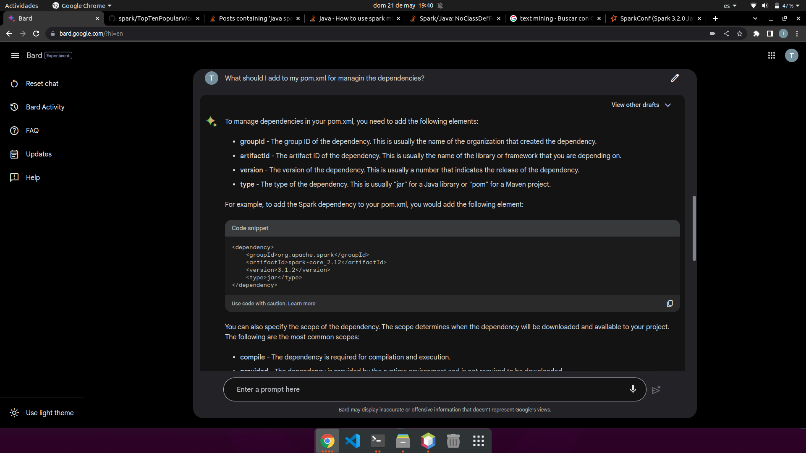

Para esta parte del proyecto voy a estar usando Bard(IA de Google) junto con stackoverflow. Notar que al momento del informe Bard solo acepta texto en inglés. Con objetivos de simplificar el Informe los prompts que le daré a Bar comenzarán con "T:" y las respuestas de Bard comenzarán con "B:"

---

## ¿Cómo se instala Spark en una computadora personal? 

- T: How can i Install Spark in ubuntu 20.04?

- B:  To install Spark on Ubuntu 20.04, follow these steps:

1. Update the package list:

```

sudo apt update

```
2. Install Java:
```
sudo apt install openjdk-11-jdk

```
3. Install Scala:
```
sudo apt install scala

```
4. Download Spark:
```
wget https://archive.apache.org/dist/spark/spark-3.2.0/spark-3.2.0-bin-hadoop3.2.tgz

```
5. Extract Spark:
```
tar -xvf spark-3.2.0-bin-hadoop3.2.tgz

```
6. Move Spark to a directory in your PATH:
```
sudo mv spark-3.2.0-bin-hadoop3.2 /opt/spark

```
7. Add the following line to your ~/.bashrc file:
```
export PATH=$PATH:/opt/spark/bin

```
8. Source your ~/.bashrc file:
```
source ~/.bashrc

```
9. Verify that Spark is installed correctly:
```
spark-shell

```
10. You should see the following output:
```
Welcome to Scala version 2.13.8 (Java HotSpot(TM) 64-Bit Server VM, Java 11.0.11).
Type in expressions to have them evaluated.
Type :help for more information.

scala>

```
Spark is now installed on your Ubuntu 20.04 system. You can start using it to process large data sets.


Seguí algunas de los pasos, ya que por ejemplo java ya lo tenía instalado y scala no lo creía necesario. Así que seguí con el paso 4 y descargué spark mediante wget no sin antes ver en Apache las demás versiones, finalmente me quede con la que Bard me ofrecía. Antes de mover la carpeta que descomprimí, consulté en stackOverflow lo siguiente:

linux opt folder purpose
Como respuesta:
## Imagenn 1


Luego continue con los pasos dados por Bard sin complicaciones.

---

##¿Qué estructura tiene un programa en Spark?

Haciendole esta pregunta a Bard obtuve la siguiente respuesta:

## imagen 2 y 3


Entonces en un programa en Spark los puntos claves: 
1. Crear un objeto de tipo **SparkConf** que es usado para crear los RDD, entregar los trabajos y manejar los recursos de los clusters. 
2. Los **RDD** los cuales son estructuras de datos de Spark. Se trata de colecciones de datos pensadas para operar en paralelo.
3. Las **Trasformaciones** son operacion que se aplican a cada RDD a la hora de crearlos.
4. Las **Acciones** son operaciones que se ejecutan dentro de los RDD para generar los resultados.

En resumen voy a crear una configuracion de Spark, luego voy a dividir los datos sobre los que voy a trabajar, y por último definir los procesos que van a trabajar sobre cada division de datos. 
Luego le pedi el mismo ejemplo pero en Java para futuras referencias y me dio este ejemplo:

## imagen 7


Pero antes tengo que ver como manejar las dependencias con Maven. Entonces le pregunté a Bard lo siguiente:

## imagen 4, 5 y 6




Una vez agregado el primer ejemplo a mi pom.xml pasemos a la siguiente pregunta.

---

##¿Qué estructura tiene un programa de conteo de palabras en diferentes documentos en Spark?

Le hice esta pregunta a Bard y me respondió lo siguiente:

## imagen 8 y 9


---

##¿Cómo adaptar el código del Laboratorio 2 a la estructura del programa objetivo en Spark?

Usando las referencias de Bard y trate de adaptar el método computeNamedEntities de Article.java. Luego la funcion quedo de la siguiente manera 

## Imagen 19 


Entonces solo queda refactorizar la parte del código donde itero sobre cada entidad nombrada y checkeo si ya está cargada o no, y setear la frecuencia en la que aparece. Para esto primero tengo que saber cual es la estructura del objeto JavaPairRdd, le pregunté a Bar lo siguiente:

## Imagen 11


Después de eso le pregunté lo siguiente:

## Imagen 13 y 14


Modifiqué el ejemplo que me proporcionó Bard para que la función lambda del foreach sea la que ya teníamos en el código del laboratorio 2. Quedando de la siguiente manera

## Imagen 12


Esta implementación tiene un problema, los cambios que se hacen dentro del foreach no tienen efectos por fuera de la función. Por eso el conteo de entitdades siempre me devuelve 0.
Para averiguar por qué pasa esto le pregunté a Bard lo siguiente:

## Imagen 17 y 18


Entonces voy a tratar de pasar mi objeto JavaPairRDD a una estructura de datos que pueda iterar en Java ya que la solución que me dio Bard no me funciona correctamente. Le pregunté lo siguiente a Bard:

## Imagen 15 


Elegí la opcion de convertir a un diccionario, ya que me parecié lo más sencillo dado la estructura de el objeto JavaPairRDD que estoy usando. Entonces le pregunté como iterar sobre esta estructura.

## Imagen 16


Con estas modificaciones el códiigo ya funciona de manera correcta.

---

##¿Cómo se integra una estructura orientada a objetos con la estructura funcional de map-reduce?

Bard:

There are a few ways to integrate an object-oriented framework with the functional framework of map-reduce. One way is to use a library that provides a map-reduce implementation for the object-oriented language. For example, there are libraries for Java, Python, and C++ that provide map-reduce implementations.

Another way to integrate object-oriented frameworks with map-reduce is to use a framework that provides a layer of abstraction between the two. For example, Hadoop provides a map-reduce framework that can be used with any language that can be compiled to Java bytecode.

Finally, it is also possible to implement map-reduce manually in an object-oriented language. This can be done by creating classes that represent the map and reduce functions, and then using these classes to process data.

The best way to integrate an object-oriented framework with map-reduce will depend on the specific needs of the application. If there is a library available for the language that is being used, then that is the easiest option. If there is no library available, then a framework that provides a layer of abstraction can be used. Finally, if the application requires a specific level of control, then it may be necessary to implement map-reduce manually.

Here are some examples of how object-oriented frameworks can be integrated with map-reduce:

In Java, the Hadoop MapReduce framework can be used to process data using object-oriented classes.
In Python, the PySpark framework can be used to process data using object-oriented classes.
In C++, the Apache Beam framework can be used to process data using object-oriented classes.
These are just a few examples of how object-oriented frameworks can be integrated with map-reduce. The specific approach that is used will depend on the specific needs of the application.

---
