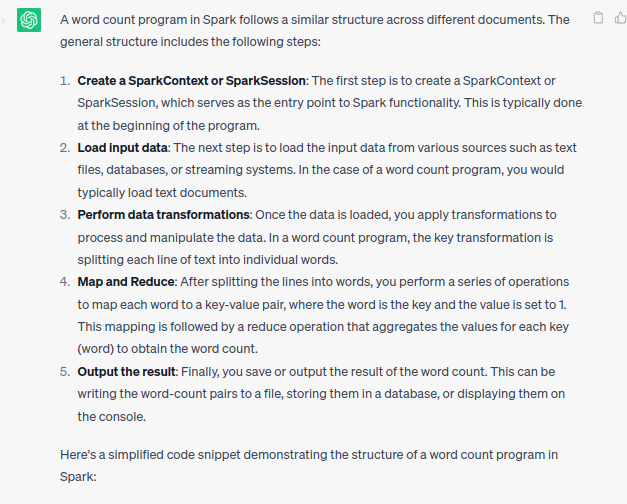
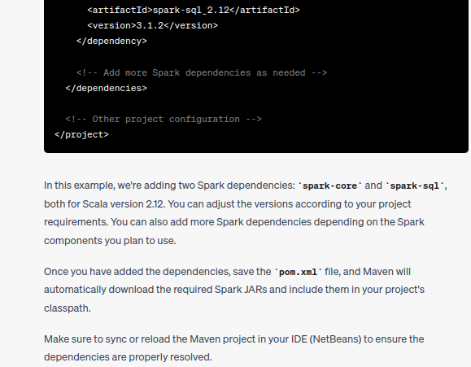

# Laboratorio 3: Programación asistida para Frameworks sobre Cálculo Distribuido

Carabelos Milagros

---

En la primera etapa individual de desarrollo del proyecto, he decidido utilizar ChatGPT en ingles y código de ejemplo obtenido de algún proyecto obtenido en _______.  Esta combinación me permitirá aprovechar la capacidad de generación de diálogos de ChatGPT para obtener información relevante y enriquecer mi documentación. Al mismo tiempo, utilizaré ejemplos de código provenientes de proyectos en  para respaldar y ejemplificar los conceptos teóricos presentados en el informe. Esta estrategia me brinda una amplia gama de recursos y fuentes de información para garantizar la calidad y precisión de mi documentación.

## ¿Cómo se instala Spark en una computadora personal?

La primera acción a realizar es instalar Spark y para ello recurrí a ChatGPT:


Siguiendo estas indicaciones logré una instalación exitosa.

## ¿Qué estructura tiene un programa en Spark?

Primero le pregunté a ChatGPT y conseguí la siguiente respuesta:


Me convenció la respuesta, ya que la regeneré varias veces y parecía ser siempre más o menos la misma respuesta. No hay ninguna alucinación clara, así que decidí continuar con las siguientes preguntas para intentar implementar el cambio en mi código y así comprobar si esto era realmente cierto.

---

## ¿Qué estructura tiene un programa de conteo de palabras en diferentes documentos en Spark?

Primero vamos a preguntarle a Chat qué piensa:



Me pareció bastante buena la respuesta, pero decidí profundizar y refinar la pregunta para mejorar mi entendimiento sobre Spark. Así que pregunté nuevamente a Chat, esta vez para que explique cada línea por separado. Llevo utilizando esta técnica para entender proyectos orientados a objetos desde el inicio del cuatrimestre y me funciona bastante bien, especialmente en códigos como el anterior que utilizan principalmente funciones de librerías y que, por lo general, no sé qué tareas realizan ni qué tipos de parámetros pueden tomar como argumentos.


## ¿Cómo adaptar el código del Laboratorio 2 a la estructura del programa objetivo en Spark?
Con esto en mente, ya era bastante obvia la tarea que convenía realizar a continuación: copiar este código al proyecto y ver cómo debería adaptarlo. Para ello, primero identifiqué qué parte del código se dedicaba a hacer el conteo de las ocurrencias. En nuestro caso, la función

```
 public void computeNamedEntities(Heuristic h)
```

ubicada en la clase "Article", era la encargada de esta tarea. Originalmente, estaba definida como:


Lo primero que intenté cambiar por una implementación con Spark fue el segundo bucle for, en el cual se dividía el texto del artículo en palabras, luego se filtraba con la heurística para determinar qué palabras eran efectivamente entidades nombradas, y finalmente se agregaba la entidad nombrada a la lista de entidades si no estaba ya en esta lista, o se incrementaba su frecuencia si ya había sido agregada.

Partiendo del código de ejemplo de Chat, intenté cambiar las variables a las locales de mi programa y encontré el primer problema. En el caso de Chat, lo que se pasa como argumento en la línea:

```
// Load input data (text files)        
JavaRDD<String> textFile = sc.textFile("hdfs://...");
```

es el path a un archivo, mientras que en nuestro caso lo que tenemos es un string con el texto correspondiente al artículo. Para resolver este problema, le pregunté a ChatGPT por un nuevo código que solucionara este inconveniente.


En este punto, es interesante tener en cuenta la siguiente aclaración: no tiene mucho sentido hacerlo para un solo string, pero como nuestra llamada a función está dentro de un bucle que itera en cada artículo de cada feed, tiene sentido paralelizarlo, ya que usamos esta función repetidas veces.

Con las modificaciones introducidas por la ultima ayuda de chat todo parecia ir bien pero habia un filter que tenia sentido hacer y todavia no habia tenido en cuenta. En nuestro codigo orignial se chequeaba si las palabras eran entidades antes de agregarlas a la lista de entidades, tarea que tendria sentido paralelizar, pidiendole ayuda a chat obtuve la siguiente respuesta


Esta respuesta no solo es útil, sino que además crea una heurística para ver si cada entidad es nombrada, de acuerdo a si comienza con mayúscula, una de las formas que mencionamos en clase varias veces y que nos da una pauta de que la respuesta de Chat está encaminada a lo que representa nuestro problema.

Genial, con esta parte del programa más o menos armada, me dispuse a intentar mejorar la función eliminando el primer bucle que sanitiza el texto, eliminando caracteres irrelevantes y delegando esta actividad también a Spark. Para ello, le pregunté a Chat cómo podía usar Spark para dicha acción, dándole además un poco de contexto del código de Spark que ya existía en mi proyecto, para que no me abriera otra sección de Spark y tomara en cuenta las transformaciones que ya le habíamos hecho a nuestro string que guardaba el texto del artículo.


Consideré esta respuesta buena, ya que utilizaba el método *map* y modularizaba la tarea de *removeCharacters*. Así que decidí seguir las recomendaciones de Chat e intenté compilar el programa. En nuestro caso, unificamos con mi grupo el uso de NetBeans como IDE para programar tanto el Laboratorio 2 como el actual. Esta decisión la tomamos siguiendo las recomendaciones para el Laboratorio 2 e intentando facilitar el manejo de dependencias en Java, al tiempo que unificábamos entre nosotros la estructura que iba a tener el proyecto, más allá del código, sino de acuerdo a las dependencias. Además, aprendimos un poco sobre un IDE más completo y complejo que el Visual Studio Code que solíamos usar los tres.

Por lo tanto, cuando intenté compilar, surgieron los primeros problemas de dependencias y me ayudé de la IA para intentar resolverlos. Voy a omitir los códigos de error en el informe, ya que son muy largos y tediosos de leer, pero mostraré las partes útiles de las respuestas de Chat.




Adaptando la respuesta de Chat a las versiones de Spark que tenía instaladas, desde la página oficial de Spark, pude resolver los problemas de dependencias. Sin embargo, me encontré con problemas de código, los cuales compartí con Chat para intentar encontrar soluciones.


Con estas aclaraciones sobre cómo definir el entorno, modifiqué mi código, que en este punto compilaba perfectamente. Pero al ejecutarlo, me encontré con un problema adicional, el cual consulté a Chat.


Sin casi darle contexto sobre el problema, la IA resolvió el problema de una manera que me pareció adecuada. Sin embargo, para asegurarme de la solución y evitar aplicar una solución parche sin tener más referencias, consulté en [Stack Overflow](https://stackoverflow.com/questions/24046744/javaspark-org-apache-spark-sparkexception-job-aborted-task-not-serializable). Finalmente, me conformé con la solución encontrada y volví a ejecutar mi proyecto, el cual ahora funcionaba correctamente. Al comparar los resultados obtenidos con los del laboratorio 2, parecía tener un funcionamiento adecuado.

Luego de esto, realicé algunos tests para asegurarme de que todo funcionara bien y me di cuenta de que la forma en que establecíamos la frecuencia de las entidades nombradas debía ser modificada. En la implementación inicial, cada vez que se inicializaba una entidad nombrada, comenzaba con una frecuencia de 1 y luego se iba aumentando cada vez que se encontraba la misma entidad nombrada. Sin embargo, en nuestra nueva implementación, al crear un objeto del tipo "entidad nombrada", ya sabía cuántas veces aparecía en total en el artículo. Por lo tanto, a la hora de crear la instancia de la entidad nombrada, pude establecer su frecuencia.

Logré modificar el método `getCategory` de la clase `Heuristica` agregándole el parámetro `count`, que es el entero correspondiente a la cantidad de veces que aparece la palabra `word` en mi artículo. De esta manera, al llamar a:

```
this.namedEntityList.add(h.getCategory(word, count));
```

Agrego la entidad nombrada a mi lista de entidades, pero también, mediante `getCategory`, instancio el objeto en la clase correspondiente y establezco la frecuencia con la que aparece en el texto.


### Test

Para verificar el funcionamiento del programa, le solicité a ChatGPT que generara un texto en el que se mencionaran varias veces algunas de las entidades nombradas presentes en nuestro diccionario de la clase Heuristic. Aquí está la respuesta obtenida:


Luego, copié el texto generado a un editor de texto para contar manualmente cuántas veces se mencionaban cada una de las entidades. Comparé estos resultados con la salida del programa y encontré que coincidían para las entidades conocidas que estaban en el diccionario. También noté que había algunas menciones adicionales de entidades que no estaban en el diccionario.

## ¿Cómo se integra una estructura orientada a objetos con la estructura funcional de map-reduce?

Realicé esta consulta a ChatGPT varias veces, pero las respuestas fueron bastante generales y no se ajustaron completamente a nuestro trabajo específico en este laboratorio.


Si bien la respuesta se condice con lo que sucede en nuestro laboratorio, creo que es importante destacar cierta sutileza en cuanto a cómo nos comunicamos entre los diferentes paradigmas. Spark utiliza un paradigma funcional, lo cual garantiza que no habrá condiciones de carrera y permite el uso seguro de múltiples procesos para paralelizar las tareas. Sin embargo, debemos tener especial cuidado en cómo organizamos la información para lograr que Spark pueda interpretar la base de datos introducida, así como también en la forma en la cual accedemos a los datos generados por Spark y los introducimos en nuestro programa, que está naturalmente orientado a objetos.

Para hacer este cambio de paradigmas entre la orientación a objetos propia de Java y el paradigma funcional utilizado por Spark, realizamos algunas operaciones de transformación en nuestra información que facilitan la "conexión" entre estos dos paradigmas tan diferentes. La transformación más importante consiste en crear un objeto RDD que contenga la información que queremos compartir con Spark de manera que pueda interpretarla correctamente.

Esta línea en mi programa realiza esa tarea:
`JavaRDD<String> textRDD = sc.parallelize(Arrays.asList(textNotice))`

Este RDD (Resilient Distributed Dataset) es una estructura fundamental para trabajar con Spark, ya que al estar diseñado para trabajar distribuidamente en bases de datos entre diferentes procesadores, este objeto proporciona la capacidad de dividir la base de datos en particiones y entregar un fragmento de estos datos a cada unidad destinada a realizar operaciones sobre la base de datos, de modo que puedan trabajar en paralelo. Además, este tipo de objeto le permite a Spark persistir información en disco y/o en la memoria RAM. De esta manera, parte de la información que fue procesada puede ser guardada en caché o en disco y reutilizarse si es necesario, mejorando la eficiencia de nuestro programa.

En otras palabras, al convertir nuestro texto en un formato RDD, de cierta manera la operación que estamos realizando es una "traducción" de nuestra base de datos a una estructura conocida por Spark, con la cual puede trabajar de manera segura y eficiente.

## Recursos utilizados

Durante el desarrollo del proyecto, utilicé principalmente la interacción con ChatGPT para obtener respuestas y orientación sobre diferentes aspectos del mismo. No hice referencia directa a ningún código de ejemplo en particular, ya que la interacción con la IA fue suficiente para completar el proyecto.

Además, como detalle adicional, intenté seguir la estructura sugerida en el [video](https://www.instagram.com/p/CrBjDt5sfgp/) que busca mejorar el rendimiento y la calidad de las respuestas proporcionadas por ChatGPT.
Como mencioné anteriormente, utilicé NetBeans como IDE para poder compilar Java sin tantas dificultades. El código proporcionado corresponde a un proyecto tipo Maven, por lo que la forma de compilar es exactamente la misma que se explicó en el Lab 2.
